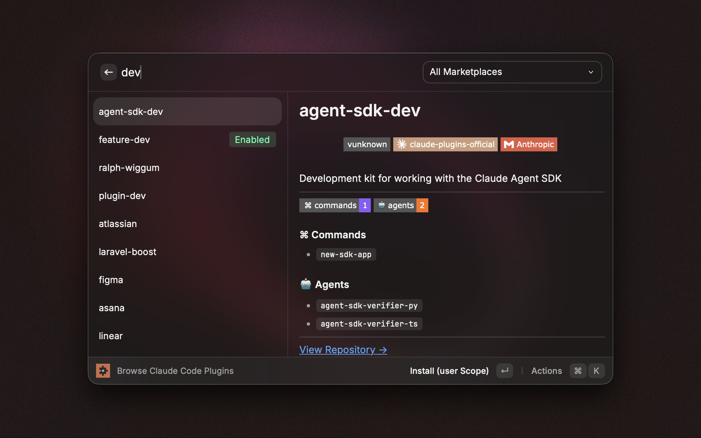
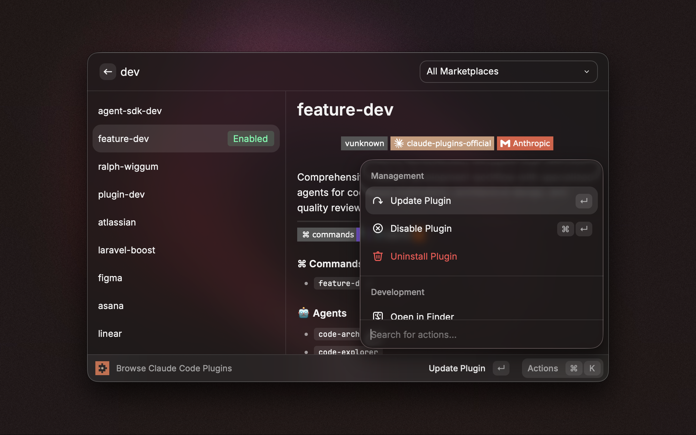
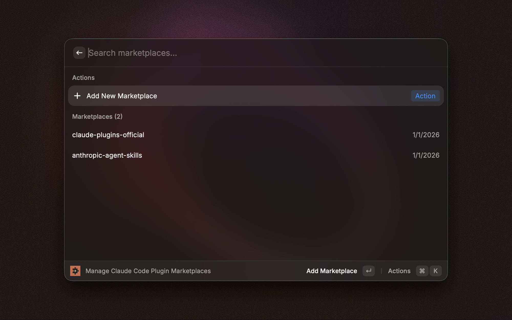
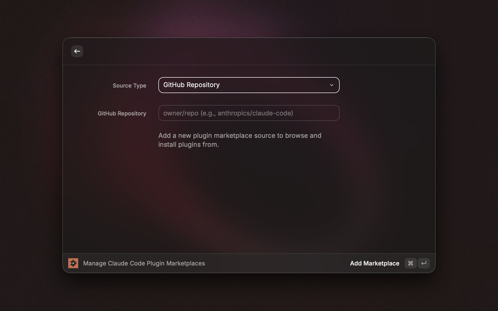

  

  # Claude Code Plugins Manager

  **A Raycast Extension for browsing, installing, and managing Claude Code plugins**

  
  
  
  

  [Installation](#-installation) • [Features](#-features) • [Usage](#-usage)

---

## ✨ Features

- **Browse & Install** - Search and install plugins from all marketplaces with scope selection
- **Manage Marketplaces** - Add, update, or remove plugin sources (GitHub, local, Git, remote)
- **Plugin Details** - View components (commands, skills, agents, hooks, MCP servers)
- **Quick Actions** - Copy plugin IDs, access source code, and more

## 📸 Screenshots

| Browse Plugins | Plugin Actions |
|:---:|:---:|
|  |  |

| Manage Marketplaces | Add Marketplace |
|:---:|:---:|
|  |  |

## 📋 Requirements

- macOS with [Raycast](https://raycast.com) installed
- [Claude Code CLI](https://code.claude.com)

## 🚀 Installation

Search for **"Claude Code Plugins Manager"** in [Raycast Store](https://raycast.com/store) (coming soon).

## 💡 Usage

Open Raycast (`⌘ + Space`) and search for:

- **Browse Claude Code Plugins** - Search and install plugins
- **Manage Claude Code Plugin Marketplaces** - Configure plugin sources

Supported marketplace types: GitHub repo (`owner/repo`), local directory, Git URL, or remote URL.

## 🤝 Contributing

Contributions are welcome! Feel free to submit issues or pull requests.

## 📄 License

MIT

## 🔗 Resources

- [Claude Code Documentation](https://code.claude.com/docs)
- [Raycast Developer Docs](https://developers.raycast.com)
- [Claude Code Plugins Guide](https://code.claude.com/docs/en/discover-plugins)

---

  Made with ❤️ for the Claude Code community

